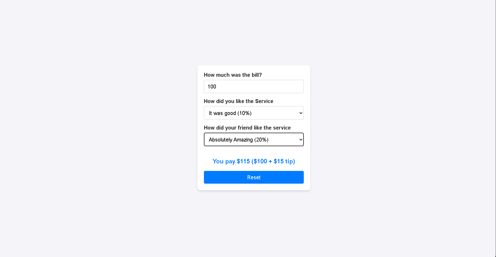
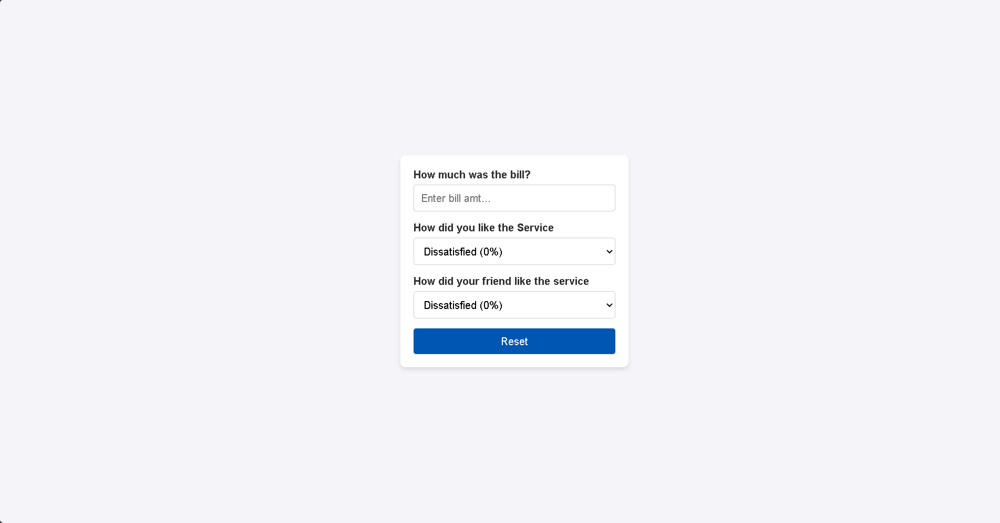

# Tip Calculator Web Application

## Overview

This Tip Calculator web application helps users calculate the total bill amount, including tips, based on their satisfaction level and their friend's satisfaction level with the service. It provides an intuitive interface to input the bill amount, select service ratings, and calculate tips accordingly.

## Features

- **Bill Input:** Enter the total bill amount.
- **Service Ratings:** Select satisfaction levels for yourself and your friend, which determine the tip percentage.
- **Tip Calculation:** Automatically calculates the tip based on the average satisfaction levels and displays the total amount to be paid.
- **Reset Button:** Clears all inputs and resets the form.
- **User-Friendly Design:** Clean and responsive design with modern CSS styling.

## Technologies Used

- **Frontend:** React.js
- **Styling:** CSS

## File Structure

```
project-directory/
|-- src/
    |-- App.js          # Main React component
    |-- index.js        # Entry point
    |-- styles.css      # Custom CSS for styling
```

## Installation

1. Clone the repository:
   ```bash
   git clone <repository-url>
   ```

2. Navigate to the project directory:
   ```bash
   cd project-directory
   ```

3. Install dependencies:
   ```bash
   npm install
   ```

4. Start the development server:
   ```bash
   npm start
   ```

5. Open the application in your browser at:
   ```
   http://localhost:3000
   ```

## Usage

1. Enter the total bill amount in the input field.
2. Select satisfaction levels from the dropdown menus for yourself and your friend.
3. The application will calculate and display the total amount (bill + tip).
4. Use the reset button to clear inputs and start over.

## Screenshot




## CSS Styling

The application uses modern CSS for a clean and responsive design. Highlights include:
- **Background:** A subtle light gray for the app's background.
- **Card Design:** The form is styled as a centered card with rounded corners and a shadow.
- **Interactive Elements:** Buttons and inputs feature hover effects and smooth transitions.

## Example Code

### App Component (React):
```jsx
export default function App() {
  const [billamt, setBillamt] = useState("");
  const [yourReply, setYourReply] = useState(0);
  const [friendReply, setFriendReply] = useState(0);

  function handleBtnClick() {
    setBillamt("");
    setYourReply(0);
    setFriendReply(0);
  }

  return (
    <div className="App">
      <Bill billamt={billamt} onhandleBillamt={setBillamt} />
      <Reply reply={yourReply} setReply={setYourReply}>
        How did you like the Service
      </Reply>
      <Reply reply={friendReply} setReply={setFriendReply}>
        How did your friend like the service
      </Reply>
      <DisplayTotal
        billamt={billamt}
        yourReply={yourReply}
        friendReply={friendReply}
      />
      <ResetButton onhandleBtn={handleBtnClick} />
    </div>
  );
}
```

## License

This project is licensed under the MIT License. You are free to use, modify, and distribute this software as per the license terms.

---
Feel free to customize the app to add more features or improve the user experience!

